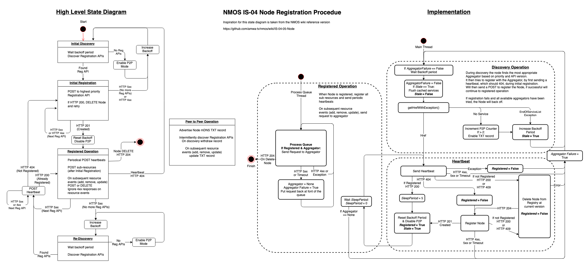

# NMOS Node API

An implementation of an AMWA NMOS IS-04 Node API.

## Introduction

Package providing a basic NMOS Node API implementation. It takes the form of a "Node Facade" which accepts data from private back-end data providers.



## Installation

### Requirements

*   Linux (untested on Windows and Mac)
*   Python 2.7 (also Python 3.6.9 on Ubuntu 18.04)
*   Python Pip
*   [NMOS Common](https://github.com/bbc/nmos-common)

### Steps

```bash
# Install Python setuptools
$ pip install setuptools

# Install the service
$ sudo python setup.py install
```

## Configuration

The Node API makes use of a configuration file provided by the [NMOS Common Library](https://github.com/bbc/nmos-common). Please see that repository for configuration details.

### Usage

The following code snippet demonstrates registering a service and its resources with the Node API.

```python
from nmosnode.facade import Facade

# Initialise service name to use for Node API interactions
nodeapi = Facade("myservice/v1.0")

# Register the service with the Node API including its own API endpoint
nodeapi.register_service("http://127.0.0.1", "myservice/v1.0")

# Heartbeat with the Node API - You'll need to call this every 5 seconds from another thread
nodeapi.heartbeat_service()

# Register your resources with the Node API
nodeapi.addResource("device", "my-device-uuid", "my-device-json-here")
```

### Non-blocking

Run the following script to start the Node Facade in a non-blocking manner, and then stop it again at a later point:

```Python
    from nmosnode.nodefacadeservice import NodeFacadeService

    service = NodeFacadeService()
    service.start()

    # Do something else until ready to stop

    service.stop()
```

### Blocking

It is also possible to run Node Facade in a blocking manner:

```Python
    from nmosnode.nodefacadeservice import NodeFacadeService

    service = NodeFacadeService()
    service.run() # Runs forever
```

## Development

### Testing

```bash
# Run the tests
$ make test
```

### Packaging

Packaging files are provided for internal BBC R&amp;D use.
These packages depend on packages only available from BBC R&amp;D internal mirrors, and may not work in other environments. For use outside the BBC please use python installation method.

```bash
# Debian packaging
$ make deb

# RPM packaging
$ make rpm
```

## Versioning

We use [Semantic Versioning](https://semver.org/) for this repository

## Changelog

See [CHANGELOG.md](CHANGELOG.md)

## Contributing

See [CONTRIBUTING.md](CONTRIBUTING.md)

Please ensure you have run the test suite before submitting a Pull Request, and include a version bump in line with our [Versioning](#versioning) policy.

## License

See [LICENSE.md](LICENSE.md)
